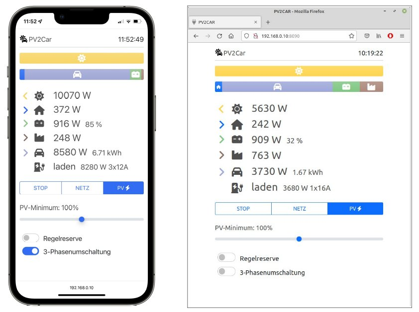

# PV2Car

Ladecontroller zum PV-Überschussladen mit einer Go-e HomeFix Wallbox.

PV2Car erfasst die Erzeugungsleistung der PV Anlage. Neben Begin und Ende
des Ladevorgangs wird der Ladestrom für das Elektrofahrzeug kontinuierlich
an die zur Verfügung stehende PV-Leistung angepasst.

 ## Features
* einfache Python Anwendung
* Webserver zur Bedienung per Smartphone
* einfache Anpassung an bestehende Installation direkt in Python
* geeignet für Raspberry Pi (auch parallel zu anderen Anwendungen) 

Standardmäßig baut PV2Car auf dem MeterHub Projekt auf (https://github.com/martiby/MeterHub). 
MeterHub bündelt die unterschiedlichen Geräte (Stromzähler, Wechselrichter,
Wallbox, ...) und stellt diese über eine JSON API zur Verfügung.      

## Installation

**Python**
 
    pip3 install -r requirements.txt

**Einstellungen**

`config.py`: Grundeinstellungen 

`adapt.py`: Anpassungen an die verwendeten Geräte/Installation 

**Service einrichten**  

    sudo cp pv2car.service /etc/systemd/system

**Service verwenden** 

    sudo systemctl start pv2car
    sudo systemctl stop pv2car
    sudo systemctl restart pv2car
    sudo systemctl enable pv2car
    sudo systemctl disable pv2car

**Logging abfragen**

    sudo journalctl -u pv2car
    sudo journalctl -u pv2car -f